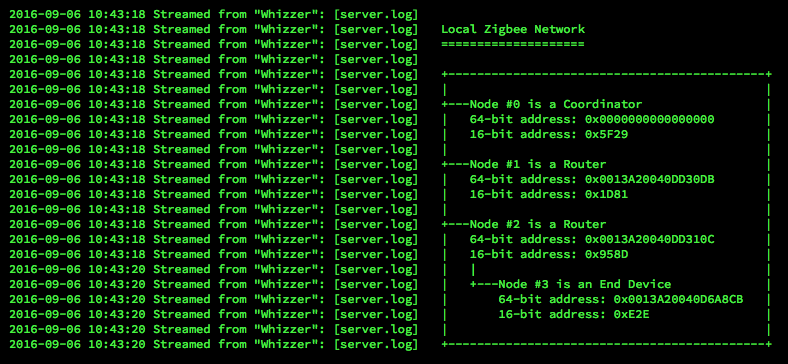

# XBee Examples

This directory contains a number of examples that demonstrate how the Electric Imp XBee library may be applied. In each case, the code is intended to be run on an imp connected to the XBee module operating as the Zigbee network’s co-ordinator. One or more remote XBee modules provide the data.

**Note** The example code includes the XBee class as an Electric Imp library. It is not yet available in this form, so for now please paste in the XBee.class.nut code in place of the `#require` line if you will to try these examples.

## enumerate.device.nut

This example runs uses various AT commands &mdash; "OI" (Operating 16-bit PAN ID), "ND" (Node Discovery) and "MP" (16-bit Parent Network Address) &mdash; to discover and list all the XBee modules on the local Zigbee network.

Set the global variable *debug* to `true` to receive further messages.

## sensor.device.nut

This simple application configures a remote XBee to sample data on its D1 pin. The sample may be digital or analog &mdash; line 68 sends the AT command "D1" to configure the pin; the parameter value 2 sets D1 as analogue input, or 3 for a digital input.

The subsequent lines set the IO sample rate (“IR”), then the top 32-bits and low 32-bits of the destination module’s 64-bit address. In this case, we pass in the address 0x0000000000000000 &mdash; the shortcut to the co-ordinator. Finally, we send “AC” to apply the settings.

The code will log any issues encountered in this process. For example, a TX failure implies you have entered an incorrect 64-bit address for the sensor module, or it is powered down.

The code should log that the sensor module has been configured and begin logging receieved data every five seconds (the set sample rate). Set the global variable *debug* to `true` to receive further messages.

## lightlevelsource.device.nut lightlevelcoordinator.device.nut

This example shows how XBees might be employed in locations where imp-based sensor devices need to be sited too far from the WiFi router for WiFi communications to be effective. Instead, Zigbee mesh networking can be employed to route sensor data from source to the Zigbee network Co-ordinator, which is also connected to an imp in range of the WiFi router. This imp might gathers, package and relay the data from multiple Zigbee-connected sensors to an Internet-hosted database.

Here we have code for both Co-ordinator and Zigbee Router and End Device units. The example simulates real sensor data by simply reading the host imp’s on-board light sensor, packaging that value and sending to the Co-ordindator, which here logs the received value.

The data source code also makes use of the “AI” AT command (for “Association Indication”) which is used to check for the availability of a Zigbee network. Only if this is present does the device begin relaying data.
